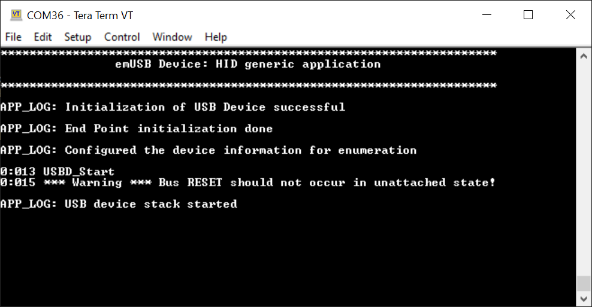
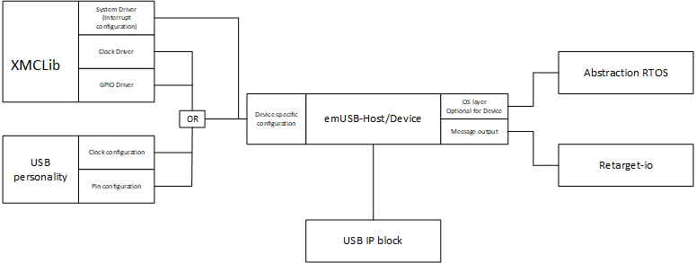

# XMC&trade; MCU: emUSB Device HID generic application

This code example demonstrates the usage of the emUSB device middleware stack to configure the USB block in a supported Infineon MCU as a generic Human Interface Device (HID). It takes help from an external HID software tool to send in the generic HID inputs which it then relays back.This example is currently supported on XMC&trade; MCU evaluation kits.

## Requirements

- [ModusToolbox&trade; software](https://www.infineon.com/modustoolbox) v3.0
- [SEGGER J-Link software](https://www.segger.com/downloads/jlink/#J-LinkSoftwareAndDocumentationPack)
- Programming language: C
- Associated parts: All [XMC&trade; MCU](https://www.infineon.com/cms/en/product/microcontroller/32-bit-industrial-microcontroller-based-on-arm-cortex-m/) parts

## Supported toolchains (make variable 'TOOLCHAIN')

- GNU Arm&reg; embedded compiler v10.3.1 (`GCC_ARM`) - Default value of `TOOLCHAIN`

## Supported Kits (make variable 'TARGET')

- [XMC4200 Platform2Go kit](https://www.infineon.com/cms/en/product/evaluation-boards/kit_xmc_plt2go_xmc4200/) (`KIT_XMC_PLT2GO_XMC4200`) - Default value of `TARGET`
- [XMC4300 relax EtherCAT kit](https://www.infineon.com/cms/en/product/evaluation-boards/kit_xmc43_relax_ecat_v1/) (`KIT_XMC43_RELAX_ECAT_V1`)
- [XMC4400 Platform2Go kit](https://www.infineon.com/cms/en/product/evaluation-boards/kit_xmc_plt2go_xmc4400/) (`KIT_XMC_PLT2GO_XMC4400`)
- [XMC4500 relax kit](https://www.infineon.com/cms/en/product/evaluation-boards/kit_xmc45_relax_v1/) (`KIT_XMC45_RELAX_V1`)
- [XMC4700 relax kit](https://www.infineon.com/cms/en/product/evaluation-boards/kit_xmc47_relax_v1/) (`KIT_XMC47_RELAX_V1`)
- [XMC4800 relax EtherCAT kit](https://www.infineon.com/cms/en/product/evaluation-boards/kit_xmc48_relax_ecat_v1/) (`KIT_XMC48_RELAX_ECAT_V1`)

## Hardware setup

This example uses the board's default configuration. See the kit user guide to ensure that the board is configured correctly.

## Software setup

This example requires an external HID software tool to act as a generic HID host for the emUSB device.

Instructions in this document use the [USB-HID tool](https://github.com/OpenAcousticDevices/USB-HID-Tool) to write and read data to/from a HID device.

Download the [USB-HID tool GitHub project](https://github.com/OpenAcousticDevices/USB-HID-Tool/archive/master.zip). You should see a */bin* folder that contains the 'usbhidtool' executable available for different systems.

Install a terminal emulator if you don't have one. Instructions in this document use [Tera Term](https://ttssh2.osdn.jp/index.html.en).


## Using the code example

Create the project and open it using one of the following:

<details open><summary><b>In Eclipse IDE for ModusToolbox&trade; software</b></summary>

1. Click the **New Application** link in the **Quick Panel** (or, use **File** > **New** > **ModusToolbox&trade; Application**). This launches the [Project Creator](https://www.infineon.com/ModusToolboxProjectCreator) tool.

2. Pick a kit supported by the code example from the list shown in the **Project Creator - Choose Board Support Package (BSP)** dialog.

   When you select a supported kit, the example is reconfigured automatically to work with the kit. To work with a different supported kit later, use the [Library Manager](https://www.infineon.com/ModusToolboxLibraryManager) to choose the BSP for the supported kit. You can use the Library Manager to select or update the BSP and firmware libraries used in this application. To access the Library Manager, click the link from the **Quick Panel**.

   You can also just start the application creation process again and select a different kit.

   If you want to use the application for a kit not listed here, you may need to update the source files. If the kit does not have the required resources, the application may not work.

3. In the **Project Creator - Select Application** dialog, choose the example by enabling the checkbox.

4. (Optionally) change the suggested **New Application Name**.

5. Enter the local path in the **Application(s) Root Path** field to indicate where the application needs to be created.

   Applications that can share libraries can be placed in the same root path.

6. Click **Create** to complete the application creation process.

For more details, see the [Eclipse IDE for ModusToolbox&trade; software user guide](https://www.infineon.com/MTBEclipseIDEUserGuide) (locally available at *{ModusToolbox&trade; software install directory}/ide_{version}/docs/mtb_ide_user_guide.pdf*).

</details>

<details open><summary><b>In command-line interface (CLI)</b></summary>

ModusToolbox&trade; software provides the Project Creator as both a GUI tool and the command line tool, "project-creator-cli". The CLI tool can be used to create applications from a CLI terminal or from within batch files or shell scripts. This tool is available in the *{ModusToolbox&trade; software install directory}/tools_{version}/project-creator/* directory.

Use a CLI terminal to invoke the "project-creator-cli" tool. On Windows, use the command line "modus-shell" program provided in the ModusToolbox&trade; software installation instead of a standard Windows command-line application. This shell provides access to all ModusToolbox&trade; software tools. You can access it by typing `modus-shell` in the search box in the Windows menu. In Linux and macOS, you can use any terminal application.

The "project-creator-cli" tool has the following arguments:

Argument | Description | Required/optional
---------|-------------|-----------
`--board-id` | Defined in the `<id>` field of the [BSP](https://github.com/Infineon?q=bsp-manifest&type=&language=&sort=) manifest | Required
`--app-id`   | Defined in the `<id>` field of the [CE](https://github.com/Infineon?q=ce-manifest&type=&language=&sort=) manifest | Required
`--target-dir`| Specify the directory in which the application is to be created if you prefer not to use the default current working directory | Optional
`--user-app-name`| Specify the name of the application if you prefer to have a name other than the example's default name | Optional

<br>

The following example will clone the "[USBD-HID-Generic](https://github.com/Infineon/mtb-example-xmc-usb-device-hid-generic)" application with the desired name "USBD_HID_generic" configured for the *KIT_XMC_PLT2GO_XMC4200* BSP into the specified working directory, *C:/mtb_projects*:

   ```
   project-creator-cli --board-id KIT_XMC_PLT2GO_XMC4200 --app-id mtb-example-xmc-usb-device-hid-generic --user-app-name USB_HID_Generic --target-dir "C:/mtb_projects"
   ```

**Note:** The project-creator-cli tool uses the `git clone` and `make getlibs` commands to fetch the repository and import the required libraries. For details, see the "Project creator tools" section of the [ModusToolbox&trade; software user guide](https://www.infineon.com/ModusToolboxUserGuide) (locally available at *{ModusToolbox&trade; software install directory}/docs_{version}/mtb_user_guide.pdf*).

</details>

<details open><summary><b>In third-party IDEs</b></summary>

**Note:** Only VS Code is supported.

1. Follow the instructions from the **In command-line interface (CLI)** section to create the application, and import the libraries using the `make getlibs` command.

2. Export the application to a supported IDE using the `make <ide>` command.

   For a list of supported IDEs and more details, see the "Exporting to IDEs" section of the [ModusToolbox&trade; software user guide](https://www.infineon.com/ModusToolboxUserGuide) (locally available at *{ModusToolbox&trade; software install directory}/docs_{version}/mtb_user_guide.pdf*).

3. Follow the instructions displayed in the terminal to create or import the application as an IDE project.

</details>

## Operation

1. Connect the board to your PC using the provided USB cable through the KitProg3 USB connector.

2. Open a terminal program and select the KitProg3 COM port. Set the serial port parameters to 8-N-1 and 115200 baud.

3. Program the board using one of the following:

   <details><summary><b>Using Eclipse IDE for ModusToolbox&trade; software</b></summary>

      1. Select the application project in the Project Explorer.

      2. In the **Quick Panel**, scroll down, and click **\<Application Name> Program (Jlink)**.
   </details>

   <details><summary><b>Using CLI</b></summary>

     From the terminal, execute the `make program` command to build and program the application using the default toolchain to the default target. The default toolchain is specified in the application's Makefile but you can override this value manually:
      ```
      make program TOOLCHAIN=<toolchain>
      ```

      Example:
      ```
      make program TOOLCHAIN=GCC_ARM
      ```
   </details>

4. After programming, the application starts automatically. Confirm that "emUSB Device: HID generic application" is displayed on the UART terminal.

   **Figure 1. Terminal output on program startup**

   


5. The user LED blinks at 2 Hz to indicate that the board is ready to be configured and used as an emUSB HID device.

6. Connect the board to your PC from the XMC&trade; USB Device port (see the kit user guide for its location) via a micro USB cable.

7. The user LED stops blinking to indicate that the USB HID device has been detected successfully.

8. On the computer, open a terminal console and run the *usbhidtool* to send a few bytes. The tool requires as argument the VID, PID, number of bytes to send, and data. See the [USB-HID tool documentation](https://github.com/OpenAcousticDevices/USB-HID-Tool/blob/master/README.md) or use the following example:

    **In Windows:**
    ```
    usbhidtool.exe 0x058B 0x0274 4 0xDE 0xAD 0xBE 0xEF
    ```

    **In Linux:**
    ```
    ./usbhidtool 0x058B 0x0274 4 0xDE 0xAD 0xBE 0xEF
    ```
    After writing to the device, you should see the same data written back to the terminal console.
    ```
    de ad be ef 00 00 00 00 00 00 00 00 00 00 00 00 00 00 00 00 00 00 00 00 00 00 00 00 00 00 00 00 00 00 00 00 00 00 00 00 00 00 00 00 00 00 00 00 00 00 00 00 00 00 00 00 00 00 00 00 00 00 00 00
    ```
    **Note:** The *usbhidtool* always sends 64 bytes to the device, independent of how many bytes provided. Any remaining data is written with zeros.

## Debugging

You can debug the example to step through the code. In the IDE, use the **\<Application Name> Debug (Jlink)** configuration in the **Quick Panel**. For details, see the "Program and debug" section in the [Eclipse IDE for ModusToolbox&trade; software user guide](https://www.infineon.com/MTBEclipseIDEUserGuide).

## Design and implementation

This code example intends to provide the functionality of a generic Human Interface Device (HID) using the Segger emUSB device middleware library. The USB Implementers Forum has defined the Human Interface Device (HID) class as an abstract USB class protocol which was developed for handling devices that would be used directly by users use to control the operation of computer systems.

The firmware consists of a `main()` function and two separate application functions (`usbd_hid_init()` and `usbd_hid_echo_task()`) to implement the desired functionality. The main function is responsible for calling the relevant emUSB device middleware target APIs and application functions (`USBD_Init()`) respectively for the initialization of the emUSB device stack, and setting up the endpoint information for HID class. For more information regarding the usage of emUSB device Target APIs, see the [emUSB Device user guide](https://github.com/Infineon/emusb-device/blob/master/docs/UM09001_emUSBD.pdf) (locally available at *<mtb_shared>/emusb-device/<version-tag>/docs*)

A report descriptor is a structure which is used to transmit the HID control data to and from an HID device. A report descriptor defines the format of a report and is composed of report items that define one or more top-level collections. Each collection defines one or more HID reports. Usages are a part of HID report descriptors which is used to indicate the vendor's suggested use for a specific control or a group of controls. The usage of an HID application is defined using a usage page ID.

This example uses the usage table for a generic USB device. See the USB Specification and the HID Usage Tables guide for detailed information about HID input, output, and feature reports.

The `usbd_hid_init()` application function utilizes  `usb_hid_generic_report` to capture the generic HID description of the emUSB device and set up the USB device endpoint. The generic USB-HID report in `usb_hid_generic_report` is generated using the following documents and HID descriptor tool given by the [USB Implementers Forum](https://www.usb.org/) (USB-IF) on their website.

 Name | Description
------|------------
[HID Spec Definition](https://www.usb.org/sites/default/files/hid1_11.pdf) | Device Class Definition for Human Interface Devices (HID) Firmware Specification (5/27/2001), Version 1.11
[HID Usage Tables](https://www.usb.org/sites/default/files/hut1_3_0.pdf) | HID Usage Tables for Universal Serial Bus (USB) Version 1.3
[HID Descriptor Tool](https://www.usb.org/document-library/hid-descriptor-tool)| Generic HID Descriptor Tool by USB Implementers Forum

The firmware then configures the device information for enumeration using the `USBD_SetDeviceInfo()` target API. After the USB core configuration is done, the `USBD_Start()` target API is called, which initiates a hardware attach and updates the endpoint configuration. The `usbd_hid_echo_task()` application function is where the USB device waits to be configured. The user LED blinks at 2 Hz to signify the wait state.

When the USB cable is connected to the device, the host will start enumeration of the device and the device will function as a generic USB HID device which echoes the generic HID inputs to the terminal using the `USBD_HID_Read()` and `USBD_HID_Write()` target APIs to read and write the HID data respectively.

   **Figure 2. Software stack**

   

## Related resources


Resources | Links
--------------------|----------------------
emUSB Device Reference | [emUSB Device](https://github.com/Infineon/emusb-device/blob/master/docs/UM09001_emUSBD.pdf) – USB Device stack for embedded applications
USB HID documentation | [Device Class Definition](https://www.usb.org/sites/default/files/hid1_11.pdf) for Human Interface Devices (HID) Firmware Specification – 5/27/2001, Version 1.11 <br> [HID Usage Tables](https://www.usb.org/sites/default/files/hut1_3_0.pdf) for Universal Serial Bus (USB) Version 1.3 <br> [HID Descriptor Tool](https://www.usb.org/document-library/hid-descriptor-tool) by the USB Implementers Forum
Code examples  | [Using ModusToolbox&trade; software](https://github.com/Infineon/Code-Examples-for-ModusToolbox-Software) on GitHub|
Device documentation| [XMC4000 family datasheets](https://www.infineon.com/cms/en/product/microcontroller/32-bit-industrial-microcontroller-based-on-arm-cortex-m/32-bit-xmc4000-industrial-microcontroller-arm-cortex-m4/#document-group-myInfineon-49) | [XMC4000 family technical reference manuals](https://www.infineon.com/cms/en/product/microcontroller/32-bit-industrial-microcontroller-based-on-arm-cortex-m/32-bit-xmc4000-industrial-microcontroller-arm-cortex-m4/#document-group-myInfineon-44) |
Libraries on GitHub  | [mtb-xmclib-cat3](https://github.com/Infineon/mtb-xmclib-cat3) – XMC&trade; peripheral driver library (XMCLib)and docs 
Tools | [Eclipse IDE for ModusToolbox&trade; software](https://www.infineon.com) – ModusToolbox&trade; software is a collection of easy-to-use software and tools enabling rapid development with Infineon MCUs, covering applications from embedded sense and control to wireless and cloud-connected systems using AIROC&trade; Wi-Fi and Bluetooth® connectivity devices.

## Other resources

Infineon provides a wealth of data at www.infineon.com to help you select the right device, and quickly and effectively integrate it into your design.

For XMC&trade; MCU devices, see [32-bit XMC™ Industrial microcontroller based on Arm® Cortex®-M](https://www.infineon.com/cms/en/product/microcontroller/32-bit-industrial-microcontroller-based-on-arm-cortex-m/).

## Document history

Document title: *CE237133* - *XMC&trade; MCU: emUSB Device HID generic application*

| Version | Description of change |
| ------- | --------------------- |
| 1.0.0   | New code example      |

------

All other trademarks or registered trademarks referenced herein are the property of their respective owners.


© 2022 Infineon Technologies AG

All Rights Reserved.

### Legal disclaimer

The information given in this document shall in no event be regarded as a guarantee of conditions or characteristics. With respect to any examples or hints given herein, any typical values stated herein and/or any information regarding the application of the device, Infineon Technologies hereby disclaims any and all warranties and liabilities of any kind, including without limitation, warranties of non-infringement of intellectual property rights of any third party.

### Information

For further information on technology, delivery terms and conditions and prices, please contact the nearest Infineon Technologies Office (www.infineon.com).

### Warnings

Due to technical requirements, components may contain dangerous substances. For information on the types in question, please contact the nearest Infineon Technologies Office.

Infineon Technologies components may be used in life-support devices or systems only with the express written approval of Infineon Technologies, if a failure of such components can reasonably be expected to cause the failure of that life-support device or system or to affect the safety or effectiveness of that device or system. Life support devices or systems are intended to be implanted in the human body or to support and/or maintain and sustain and/or protect human life. If they fail, it is reasonable to assume that the health of the user or other persons may be endangered.

-------------------------------------------------------------------------------
